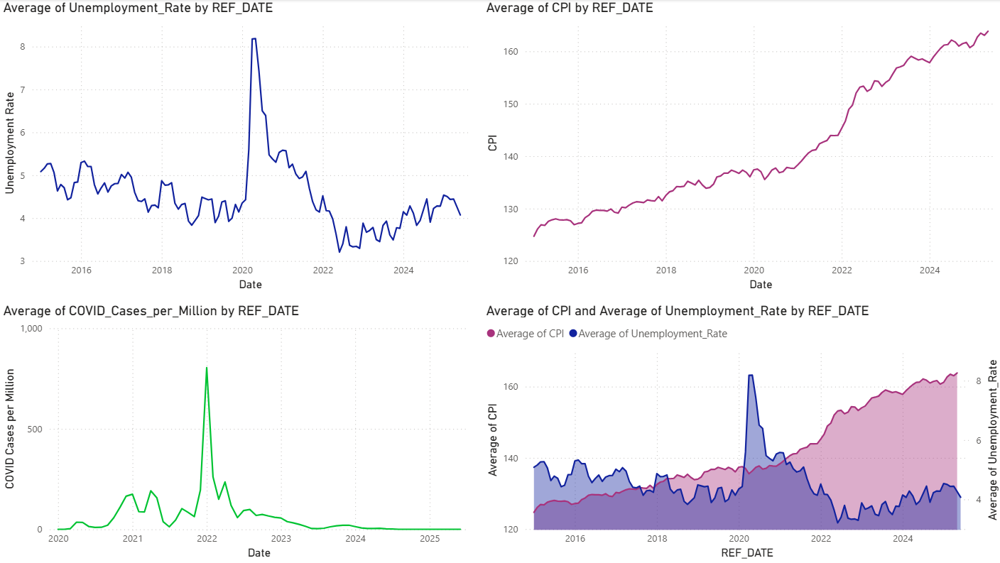
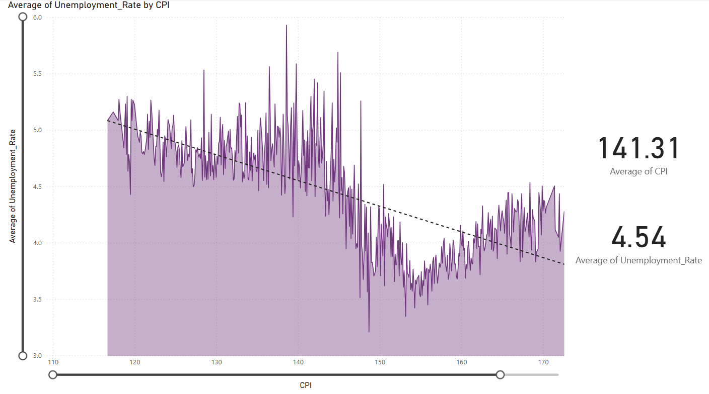
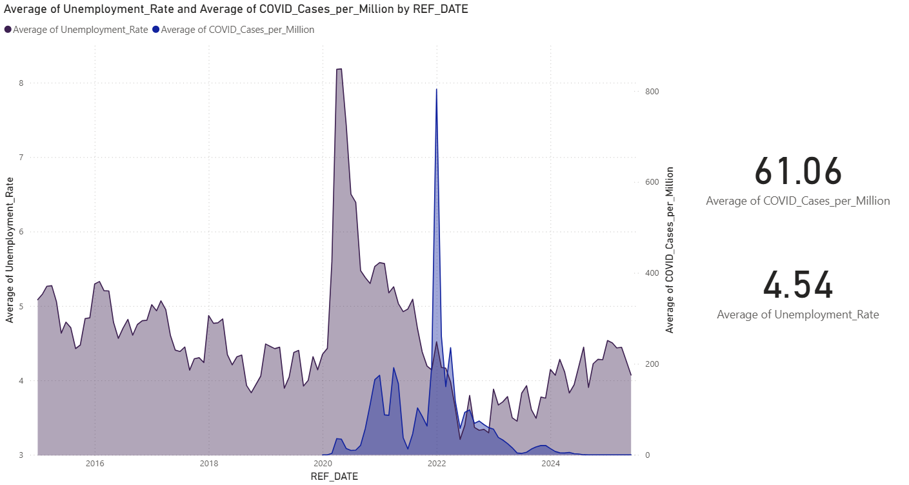

# Macroeconomics-Data-analysis-Project
# 📊 COVID-19 vs Macroeconomic Indicators in Canada (2015–2025)

This project investigates the relationship between COVID-19 cases and macroeconomic indicators in Canada—specifically the **Unemployment Rate** and **Consumer Price Index (CPI)**—from **January 2015 to December 2025**. The data was cleaned and preprocessed in Python and visualized using **Power BI**.

## 📁 Project Files

| File | Description |
|------|-------------|
| [`merged_macro_covid_data.csv`](./Final_macro_covid_data_corrected.csv) | The raw, merged dataset including CPI, unemployment rate, and COVID cases |
| [`data arrangment.ipynb`](./data%20arrangment%20(2).ipynb) | Jupyter Notebook for data cleaning and transformation |
| [`COVID dashboard.pbix`](./COVID%20dashboard.pbix) | Power BI dashboard file containing the final visualization |

---

## 🔧 Tools Used

- **Python (Pandas, NumPy)** – for data cleaning and monthly aggregation
- **Power BI** – for interactive dashboards and trend analysis
- **Excel** – to validate and handle initial formatting
- **GitHub** – version control and README documentation

---

## 🧼 Data Cleaning Summary

- Combined CPI, unemployment, and COVID datasets by matching date and geography.
- Filtered only for Canadian data.
- Removed missing values and standardized month formats.
- Aggregated all data by **month start dates** using `pd.date_range(start="2015-01-01", end="2025-12-01", freq="MS")` for consistent alignment across datasets.
- Final structure: monthly average values for each indicator.

---

## 📊 Dashboard Overview

### 🔹 Page 1: Time Series Analysis (2015–2025)

**Visuals:**

- **Line Graphs:**
  - Average **Unemployment Rate** over time.
  - Average **CPI** over time.
  - Average **COVID Cases per Million** over time.

- **Area Graph:**
  - Combined plot of **Unemployment Rate** and **CPI** to show economic pressure over time.

**Key Trends:**

- **COVID-19 Impact (2020–2021):**
  - A sharp spike in COVID-19 cases in early 2020 coincides with:
    - A **rise in unemployment**.
    - **Deflationary pressure** (CPI slowed or dropped).
- **Post-2021 Recovery:**
  - COVID cases decline.
  - **Gradual economic recovery** observed via rising CPI and dropping unemployment.

---

### 🔹 Page 2: CPI vs Unemployment Rate (Cross-Analysis)

**Visuals:**

- **Area Chart with Trend Line:**
  - **X-axis:** Average CPI
  - **Y-axis:** Average Unemployment Rate

**Key Trends:**

- **Inverse Relationship:**
  - Periods of **higher CPI (inflation)** often align with **lower unemployment**, aligning with **Phillips Curve** theory.
- **Pandemic Outlier:**
  - During COVID spikes, both CPI and unemployment rose—a deviation from historical trends.

---

### 🔹 Page 3: COVID Cases vs Unemployment Rate over date

**Visuals:**

- **Area Chart:**
  - Overlay of **Average Unemployment Rate** and **Average COVID Cases per Million**

**Key Trends:**

#### 1. **Initial Shock and Direct Correlation (e.g., Early 2020)**  
Expect to see a sharp, immediate spike in the **Unemployment Rate** coinciding with the rapid increase in **COVID-19 cases** and the implementation of initial lockdowns and public health measures.  
> This highlights the acute vulnerability of the labor market during the onset of the crisis.

#### 2. **Evolving and Decoupling Relationship (Later Phases)**  
As the pandemic progressed and economies adapted, the relationship between COVID-19 cases and unemployment became more complex. Observe that:

- Subsequent waves of COVID-19 may not show the same direct, sharp correlation with unemployment spikes.
- This reflects factors such as:
  - Economic sectors adapting to new operational models.
  - Government support programs (e.g., wage subsidies).
  - Changes in public health strategies (e.g., less stringent lockdowns due to vaccination efforts).

> Therefore, a simple “as X rises, Y spikes” statement is not consistently accurate across all periods (Dynamic nature)

---

## 📈 Interpretation & Conclusions

- The pandemic introduced a **temporary distortion** in macroeconomic behavior.
- Long-term economic indicators such as **CPI** eventually resumed pre-pandemic trends.
- The **unemployment rate** reacted more dynamically to COVID spikes.
- Economic recovery trailed public health stabilization.

---

## 🚀 How to Use This Dashboard

1. Download the `.pbix` file from the project folder.
2. Open it using **Power BI Desktop** (free).
3. Explore each tab to interact with the graphs.
4. Use filters and slicers to isolate specific periods or compare different segments.

---

## 📎 Resources

- Source: Statistics Canada + Our World in Data COVID dataset
- Tools: [Power BI Desktop](https://powerbi.microsoft.com/), [Jupyter](https://jupyter.org/), [Pandas Docs](https://pandas.pydata.org/docs/)

---

## 📬 Contact

Created by **Andrew Choga**  
🔗 GitHub: [AChoga03](https://github.com/AChoga03)
📧 Linkedin: [AChoga03]([https://github.com/AChoga03](https://www.linkedin.com/in/andrew-choga/))

---

